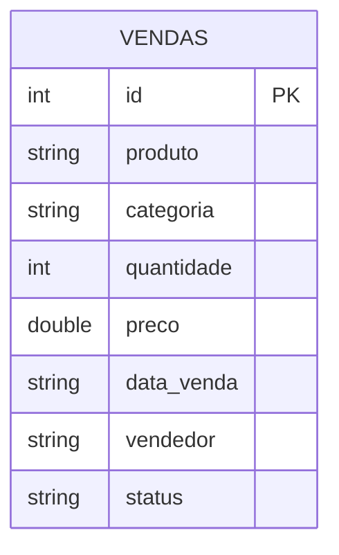

# Delta Lake

## O que é o Delta Lake?

Delta Lake é uma camada de armazenamento open-source que adiciona transações ACID ao Apache Spark. Foi criado pela Databricks e doado à Linux Foundation em 2019.

O problema que ele resolve é simples: o Parquet puro não suporta UPDATE e DELETE. Se você precisa modificar dados que já foram gravados, o Parquet tradicional não consegue — você teria que reescrever o arquivo inteiro manualmente. O Delta Lake cuida disso de forma automática e confiável.

---

## Como funciona

O Delta Lake grava os dados em arquivos Parquet normais, mas mantém um **transaction log** (`_delta_log/`) com o histórico de tudo que aconteceu na tabela. Cada operação (INSERT, UPDATE, DELETE) gera um novo arquivo de log em JSON. É isso que permite o controle de versões e o Time Travel.

```
delta-warehouse/vendas/
├── part-00000.snappy.parquet
├── part-00001.snappy.parquet
└── _delta_log/
    ├── 00000000000000000000.json   ← carga inicial
    ├── 00000000000000000001.json   ← append
    ├── 00000000000000000002.json   ← update
    └── 00000000000000000003.json   ← delete
```

---

## Principais recursos

- **Transações ACID** — operações atômicas, sem estados parciais
- **Time Travel** — consegue consultar qualquer versão anterior da tabela
- **Schema enforcement** — bloqueia gravação de dados com schema diferente por padrão
- **MERGE (UPSERT)** — combina INSERT e UPDATE em uma operação só

---

## Modelo de dados



---

## DDL da tabela

```sql
CREATE TABLE IF NOT EXISTS vendas (
    id         INT,
    produto    STRING,
    categoria  STRING,
    quantidade INT,
    preco      DOUBLE,
    data_venda STRING,
    vendedor   STRING,
    status     STRING
)
USING DELTA
LOCATION './delta-warehouse/vendas';
```

---

## Operações demonstradas

### Configuração

```python
from pyspark.sql import SparkSession
from delta import *

builder = SparkSession.builder \
    .appName("Delta Lake Demo") \
    .config("spark.sql.extensions", "io.delta.sql.DeltaSparkSessionExtension") \
    .config("spark.sql.catalog.spark_catalog", "org.apache.spark.sql.delta.catalog.DeltaCatalog")

spark = configure_spark_with_delta_pip(builder).getOrCreate()
```

### INSERT

```python
# carga inicial
df.write.format("delta").mode("overwrite").save("./delta-warehouse/vendas")

# adicionar novos registros
df_novos.write.format("delta").mode("append").save("./delta-warehouse/vendas")
```

### UPDATE

```python
from delta.tables import DeltaTable

deltaTable = DeltaTable.forPath(spark, "./delta-warehouse/vendas")

deltaTable.update(
    condition = col("status") == "pendente",
    set       = {"status": lit("pago")}
)
```

### DELETE

```python
deltaTable.delete(condition = col("status") == "cancelado")
```

### Time Travel

```python
# consultando o estado da tabela antes das modificações
df_v0 = spark.read.format("delta") \
    .option("versionAsOf", 0) \
    .load("./delta-warehouse/vendas")

df_v0.show()
```

```python
# historico de operacoes
deltaTable.history().select("version", "timestamp", "operation").show()
```

---

## Referências

- [Delta Lake — Documentação Oficial](https://docs.delta.io/latest/index.html)
- [spark-delta — jlsilva01](https://github.com/jlsilva01/spark-delta)
- [Canal DataWay BR](https://www.youtube.com/@DataWayBR)
