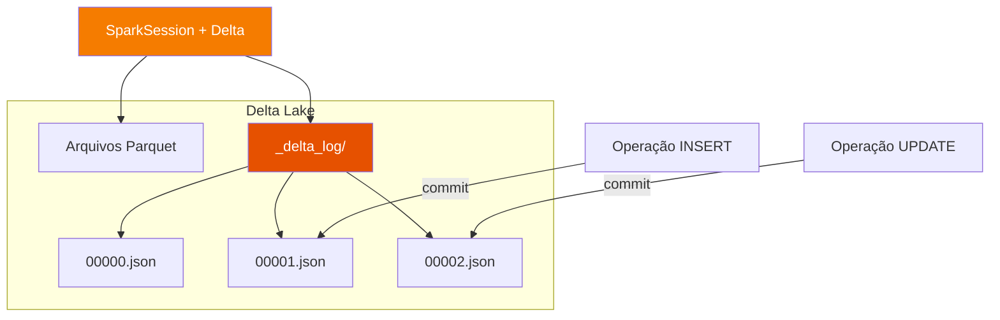
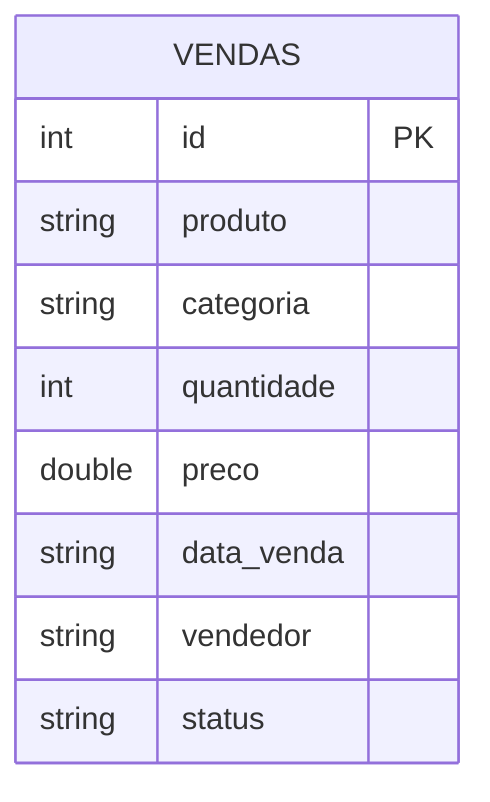

# Delta Lake

## O que é o Delta Lake?

**Delta Lake** é uma camada de armazenamento open-source que traz confiabilidade e transações ACID ao Apache Spark e a outros engines de processamento de big data. Desenvolvido pela Databricks e doado à Linux Foundation em 2019, o Delta Lake resolve os principais problemas do data lake tradicional baseado em Parquet puro.

!!! quote "Definição"
    Delta Lake é um formato de tabela aberta que fornece transações ACID, gerenciamento de metadados escalável e unificação de dados em streaming e batch sobre data lakes existentes.

---

## Arquitetura



O Delta Lake armazena os dados em **arquivos Parquet** e mantém um **transaction log** (`_delta_log/`) que registra cada operação realizada na tabela. Essa combinação é o que garante as propriedades ACID.

---

## Principais Características

### ✅ Transações ACID

| Propriedade | Descrição |
|---|---|
| **Atomicidade** | Cada operação é "tudo ou nada" — sem estados parciais |
| **Consistência** | Os dados sempre satisfazem regras de integridade definidas |
| **Isolamento** | Leituras e escritas simultâneas não interferem entre si |
| **Durabilidade** | Dados confirmados (committed) sobrevivem a falhas |

### ⏳ Time Travel (Versionamento de Dados)

O Delta Lake mantém histórico completo de todas as versões da tabela. É possível consultar dados em qualquer ponto no tempo:

```python
# Consultar versão específica
df_v0 = spark.read.format("delta").option("versionAsOf", 0).load("./delta-warehouse/vendas")

# Consultar por timestamp
df_ts = spark.read.format("delta").option("timestampAsOf", "2024-01-01").load("./delta-warehouse/vendas")
```

### 🔄 Schema Evolution e Enforcement

```python
# Schema enforcement: bloqueia escrita de dados com schema diferente (padrão)
# Schema evolution: permite adicionar novas colunas automaticamente
df.write.format("delta") \
    .option("mergeSchema", "true") \
    .mode("append") \
    .save("./delta-warehouse/vendas")
```

### 🗑️ Vacuum — Limpeza de Arquivos Antigos

```python
from delta.tables import DeltaTable

deltaTable = DeltaTable.forPath(spark, "./delta-warehouse/vendas")
deltaTable.vacuum(retentionHours=168)  # remove arquivos com mais de 7 dias
```

---

## Modelo de Dados (ER)



---

## DDL da Tabela

```sql
CREATE TABLE IF NOT EXISTS vendas (
    id         INT           COMMENT 'Identificador único da venda',
    produto    STRING        COMMENT 'Nome do produto vendido',
    categoria  STRING        COMMENT 'Categoria do produto',
    quantidade INT           COMMENT 'Quantidade de itens vendidos',
    preco      DOUBLE        COMMENT 'Preço unitário em R$',
    data_venda STRING        COMMENT 'Data da transação (YYYY-MM-DD)',
    vendedor   STRING        COMMENT 'Nome do vendedor',
    status     STRING        COMMENT 'Status: pendente | pago | entregue | cancelado'
)
USING DELTA
LOCATION './delta-warehouse/vendas'
COMMENT 'Tabela de vendas de e-commerce — Delta Lake';
```

---

## Operações na Prática

### Configurando o SparkSession

```python
from pyspark.sql import SparkSession
from delta import *

builder = SparkSession.builder \
    .appName("Delta Lake Demo") \
    .config("spark.sql.extensions", "io.delta.sql.DeltaSparkSessionExtension") \
    .config("spark.sql.catalog.spark_catalog", "org.apache.spark.sql.delta.catalog.DeltaCatalog")

spark = configure_spark_with_delta_pip(builder).getOrCreate()
```

---

### INSERT — Inserindo Dados

=== "Append (adicionar registros)"

    ```python
    from pyspark.sql.types import StructType, StructField, IntegerType, StringType, DoubleType

    schema = StructType([
        StructField("id",         IntegerType(), False),
        StructField("produto",    StringType(),  True),
        StructField("categoria",  StringType(),  True),
        StructField("quantidade", IntegerType(), True),
        StructField("preco",      DoubleType(),  True),
        StructField("data_venda", StringType(),  True),
        StructField("vendedor",   StringType(),  True),
        StructField("status",     StringType(),  True),
    ])

    novos_dados = [(16, "Fone Bluetooth", "Eletrônicos", 1, 299.90, "2024-04-01", "Carlos", "pendente")]

    df_novo = spark.createDataFrame(novos_dados, schema)

    df_novo.write.format("delta") \
        .mode("append") \
        .save("./delta-warehouse/vendas")
    ```

=== "Overwrite (substituir tudo)"

    ```python
    df.write.format("delta") \
        .mode("overwrite") \
        .save("./delta-warehouse/vendas")
    ```

---

### UPDATE — Atualizando Registros

```python
from delta.tables import DeltaTable

deltaTable = DeltaTable.forPath(spark, "./delta-warehouse/vendas")

# Atualiza o status de todas as vendas 'pendente' para 'pago'
deltaTable.update(
    condition = "status = 'pendente'",
    set       = {"status": "'pago'"}
)
```

!!! tip "UPDATE com SQL"
    ```python
    spark.sql("""
        UPDATE delta.`./delta-warehouse/vendas`
        SET status = 'entregue'
        WHERE status = 'pago' AND data_venda < '2024-03-01'
    """)
    ```

---

### DELETE — Removendo Registros

```python
from delta.tables import DeltaTable

deltaTable = DeltaTable.forPath(spark, "./delta-warehouse/vendas")

# Remove todas as vendas canceladas
deltaTable.delete(condition = "status = 'cancelado'")
```

!!! tip "DELETE com SQL"
    ```python
    spark.sql("""
        DELETE FROM delta.`./delta-warehouse/vendas`
        WHERE status = 'cancelado'
    """)
    ```

---

### MERGE (UPSERT)

O MERGE é uma das operações mais poderosas do Delta Lake, combinando INSERT e UPDATE em uma única operação:

```python
from delta.tables import DeltaTable

deltaTable = DeltaTable.forPath(spark, "./delta-warehouse/vendas")

atualizacoes = spark.createDataFrame([
    (1, "Notebook Pro", "Eletrônicos", 1, 4500.00, "2024-01-15", "Ana", "entregue"),
], schema)

deltaTable.alias("tabela").merge(
    atualizacoes.alias("novos"),
    "tabela.id = novos.id"
).whenMatchedUpdateAll() \
 .whenNotMatchedInsertAll() \
 .execute()
```

---

### Time Travel — Consultando Histórico

```python
from delta.tables import DeltaTable

deltaTable = DeltaTable.forPath(spark, "./delta-warehouse/vendas")

# Ver histórico de operações
deltaTable.history().select(
    "version", "timestamp", "operation", "operationParameters"
).show(truncate=False)
```

```python
# Consultar versão anterior (antes do UPDATE)
df_anterior = spark.read.format("delta") \
    .option("versionAsOf", 0) \
    .load("./delta-warehouse/vendas")

df_anterior.show()
```

---

## Transaction Log (_delta_log)

Cada operação gera um arquivo JSON no diretório `_delta_log/`:

```
delta-warehouse/vendas/
├── part-00000-abc.snappy.parquet    ← dados
├── part-00001-def.snappy.parquet    ← dados
└── _delta_log/
    ├── 00000000000000000000.json    ← CREATE / INSERT inicial
    ├── 00000000000000000001.json    ← UPDATE
    └── 00000000000000000002.json    ← DELETE
```

Cada arquivo de log contém metadados como:
- Arquivos adicionados (`add`)
- Arquivos removidos (`remove`)
- Metadados da tabela (`metaData`)
- Informações de commit (`commitInfo`)

---

## Referências

- [Delta Lake — Documentação Oficial](https://docs.delta.io/latest/index.html)
- [Delta Lake no GitHub](https://github.com/delta-io/delta)
- [spark-delta — jlsilva01](https://github.com/jlsilva01/spark-delta)
- [Canal DataWay BR](https://www.youtube.com/@DataWayBR)
