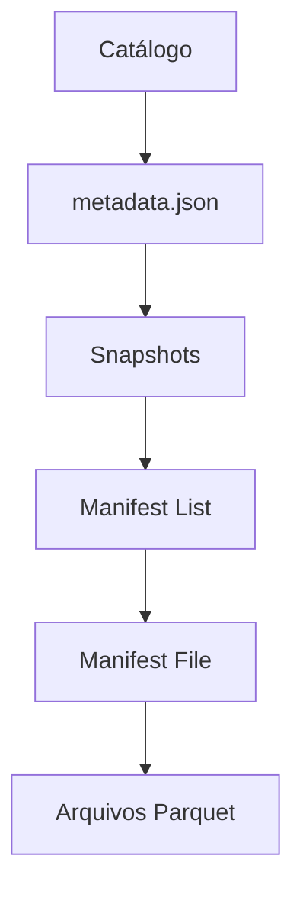
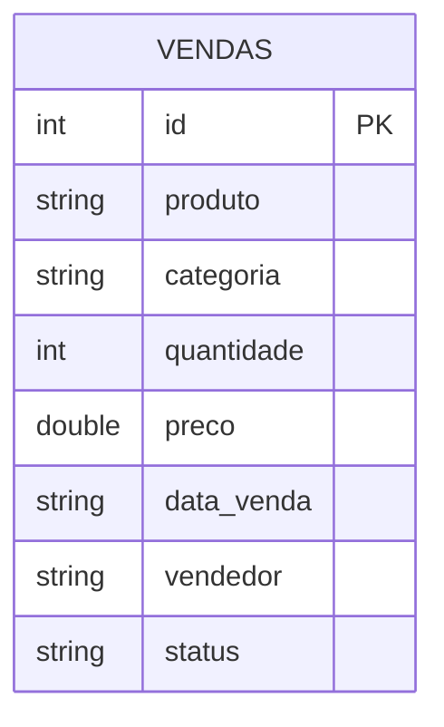

# Apache Iceberg

## O que é o Apache Iceberg?

Apache Iceberg é um formato de tabela aberta (*open table format*) criado pela Netflix para resolver problemas de escala com tabelas Hive em produção. Foi doado à Apache Software Foundation em 2018 e hoje é um dos formatos mais populares para data lakes modernos.

Assim como o Delta Lake, o Iceberg resolve o problema da falta de suporte a UPDATE e DELETE no Parquet puro, mas com uma abordagem diferente baseada em snapshots e manifests.

---

## Como funciona

O Iceberg organiza os dados em camadas:



Cada operação cria um novo **snapshot** que aponta para os arquivos de dados daquele momento. O catálogo sempre aponta para o snapshot mais recente. Isso garante isolamento e permite Time Travel sem mover dados.

---

## Principais recursos

- **Transações ACID** — assim como o Delta Lake
- **Snapshots** — cada operação gera um snapshot, rastreável
- **Time Travel** — consulta qualquer snapshot pelo ID ou timestamp
- **Schema Evolution** — renomear e adicionar colunas sem downtime
- **Particionamento oculto** — o Iceberg gerencia partições automaticamente, sem expor ao usuário
- **Multi-engine** — suporta Spark, Flink, Trino, Hive e outros lendo a mesma tabela

---

## Modelo de dados



---

## DDL da tabela

```sql
CREATE TABLE local.db.vendas (
    id         INT,
    produto    STRING,
    categoria  STRING,
    quantidade INT,
    preco      DOUBLE,
    data_venda STRING,
    vendedor   STRING,
    status     STRING
)
USING iceberg;
```

---

## Operações demonstradas

### Configuração

O Iceberg precisa do JAR de runtime. A forma mais simples com PySpark é passar via variável de ambiente antes de criar a sessão:

```python
import os
os.environ["PYSPARK_SUBMIT_ARGS"] = (
    "--packages org.apache.iceberg:iceberg-spark-runtime-3.5_2.12:1.7.1 pyspark-shell"
)

spark = SparkSession.builder \
    .appName("Iceberg Demo") \
    .config("spark.sql.extensions",
            "org.apache.iceberg.spark.extensions.IcebergSparkSessionExtensions") \
    .config("spark.sql.catalog.local", "org.apache.iceberg.spark.SparkCatalog") \
    .config("spark.sql.catalog.local.type", "hadoop") \
    .config("spark.sql.catalog.local.warehouse", "./iceberg-warehouse") \
    .getOrCreate()
```

### INSERT

```python
# usando a API writeTo do Iceberg
df.writeTo("local.db.vendas").append()

# ou via SQL
spark.sql("""
    INSERT INTO local.db.vendas VALUES
    (16, 'Fone Bluetooth', 'Eletronicos', 1, 299.90, '2024-04-01', 'Ana Silva', 'pendente')
""")
```

### UPDATE

```python
spark.sql("""
    UPDATE local.db.vendas
    SET status = 'pago'
    WHERE status = 'pendente'
""")
```

### DELETE

```python
spark.sql("""
    DELETE FROM local.db.vendas WHERE status = 'cancelado'
""")
```

### Snapshots e Time Travel

```python
# ver todos os snapshots
spark.sql("SELECT snapshot_id, committed_at, operation FROM local.db.vendas.snapshots").show()

# ler um snapshot específico
df_antigo = spark.read \
    .option("snapshot-id", id_do_snapshot) \
    .table("local.db.vendas")
```

---

## Iceberg vs Delta Lake

A principal diferença prática entre os dois é o suporte multi-engine: o Iceberg foi projetado desde o início para ser lido por vários engines diferentes (Spark, Trino, Flink), enquanto o Delta Lake historicamente tinha integração mais forte com Spark e Databricks.

Para uso com Spark puro, os dois funcionam de forma muito parecida. A escolha entre um e outro geralmente depende do ecossistema que o time já usa.

---

## Referências

- [Apache Iceberg — Documentação Oficial](https://iceberg.apache.org/docs/latest/)
- [spark-iceberg — jlsilva01](https://github.com/jlsilva01/spark-iceberg)
- [Canal DataWay BR](https://www.youtube.com/@DataWayBR)
