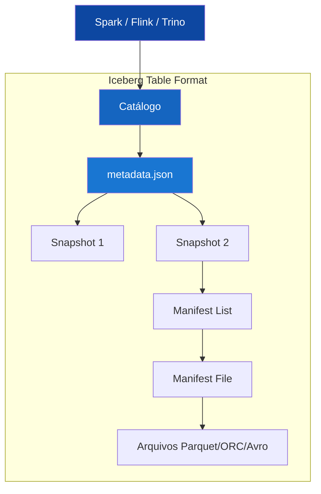
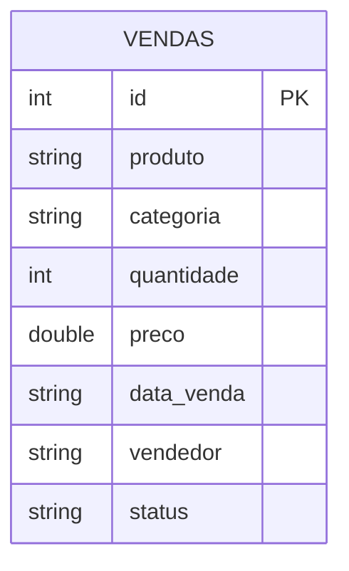

# Apache Iceberg

## O que é o Apache Iceberg?

**Apache Iceberg** é um formato de tabela aberta (*open table format*) de alto desempenho para grandes conjuntos de dados analíticos. Criado originalmente pela Netflix para resolver problemas de escala com tabelas Hive em produção, o projeto foi doado à Apache Software Foundation em 2018 e tornou-se um projeto de nível superior (TLP) em 2020.

!!! quote "Definição"
    Apache Iceberg é uma especificação aberta de formato de tabela que permite que múltiplos engines de processamento (Spark, Flink, Trino, Hive, Dremio) leiam e escrevam na mesma tabela de forma confiável e eficiente.

---

## Arquitetura



### Camadas da Arquitetura Iceberg

| Camada | Componente | Descrição |
|---|---|---|
| **Catálogo** | Catalog | Registra tabelas e localiza metadados |
| **Metadados** | `metadata.json` | Define o schema, particionamento e snapshots |
| **Snapshots** | Snapshot | Representa o estado da tabela em um ponto no tempo |
| **Manifests** | Manifest List / File | Lista os arquivos de dados de cada snapshot |
| **Dados** | Parquet / ORC / Avro | Os dados reais armazenados |

---

## Principais Características

### ✅ Transações ACID Completas

Assim como o Delta Lake, o Iceberg garante as propriedades ACID:

- **Atomicidade**: operações são completas ou não acontecem
- **Isolamento**: leitores não veem escritas parciais
- **Consistência** e **Durabilidade** garantidas pelo modelo de snapshots

### 📸 Snapshots e Time Travel

```python
# Listar snapshots
spark.sql("SELECT * FROM local.db.vendas.snapshots").show()

# Consultar snapshot específico
spark.sql("""
    SELECT * FROM local.db.vendas
    VERSION AS OF 1234567890
""")

# Rollback para snapshot anterior
spark.sql("""
    CALL local.system.rollback_to_snapshot('db.vendas', 1234567890)
""")
```

### 🔀 Evolução de Schema Sem Downtime

```python
# Adicionar coluna
spark.sql("ALTER TABLE local.db.vendas ADD COLUMN desconto DOUBLE")

# Renomear coluna
spark.sql("ALTER TABLE local.db.vendas RENAME COLUMN desconto TO desconto_pct")

# Mudar tipo de coluna (compatível)
spark.sql("ALTER TABLE local.db.vendas ALTER COLUMN quantidade TYPE BIGINT")
```

### 📦 Particionamento Oculto (Hidden Partitioning)

O Iceberg calcula automaticamente os valores de partição a partir das colunas de dados, sem expor ao usuário:

```python
# Particionamento por mês da data_venda — transparente para o usuário
spark.sql("""
    CREATE TABLE local.db.vendas_partitioned (
        id INT, produto STRING, data_venda DATE
    )
    USING iceberg
    PARTITIONED BY (months(data_venda))
""")
```

### 🔍 Poda de Partição e Arquivos (Pruning)

O Iceberg usa estatísticas de arquivos (min/max) para pular arquivos desnecessários, acelerando consultas:

```
Sem Iceberg: varre todos os arquivos → lento
Com Iceberg: elimina 90% dos arquivos via estatísticas → rápido
```

---

## Modelos de Dados (ER)



---

## DDL da Tabela

```sql
CREATE TABLE IF NOT EXISTS local.db.vendas (
    id         INT           COMMENT 'Identificador único da venda',
    produto    STRING        COMMENT 'Nome do produto vendido',
    categoria  STRING        COMMENT 'Categoria do produto',
    quantidade INT           COMMENT 'Quantidade de itens vendidos',
    preco      DOUBLE        COMMENT 'Preço unitário em R$',
    data_venda STRING        COMMENT 'Data da transação (YYYY-MM-DD)',
    vendedor   STRING        COMMENT 'Nome do vendedor',
    status     STRING        COMMENT 'Status: pendente | pago | entregue | cancelado'
)
USING iceberg
LOCATION './iceberg-warehouse/vendas'
COMMENT 'Tabela de vendas de e-commerce — Apache Iceberg';
```

---

## Operações na Prática

### Configurando o SparkSession

```python
import os
os.environ["PYSPARK_SUBMIT_ARGS"] = (
    "--packages org.apache.iceberg:iceberg-spark-runtime-3.5_2.12:1.7.1 pyspark-shell"
)

from pyspark.sql import SparkSession

spark = SparkSession.builder \
    .appName("Apache Iceberg Demo") \
    .config("spark.sql.extensions",
            "org.apache.iceberg.spark.extensions.IcebergSparkSessionExtensions") \
    .config("spark.sql.catalog.local",
            "org.apache.iceberg.spark.SparkCatalog") \
    .config("spark.sql.catalog.local.type", "hadoop") \
    .config("spark.sql.catalog.local.warehouse", "./iceberg-warehouse") \
    .getOrCreate()
```

---

### INSERT — Inserindo Dados

=== "Carga Inicial"

    ```python
    dados_iniciais = [
        (1,  "Notebook",        "Eletrônicos", 2, 3500.00, "2024-01-15", "Ana",    "entregue"),
        (2,  "Camiseta Polo",   "Roupas",      5,   89.90, "2024-01-20", "Bruno",  "entregue"),
        (3,  "Tênis Running",   "Calçados",    1,  450.00, "2024-02-01", "Carlos", "pago"),
    ]

    df = spark.createDataFrame(dados_iniciais, schema)

    df.writeTo("local.db.vendas") \
        .using("iceberg") \
        .createOrReplace()
    ```

=== "Append de Novos Registros"

    ```python
    novos_dados = [(16, "Smartwatch", "Eletrônicos", 1, 899.00, "2024-04-01", "Diana", "pendente")]

    df_novo = spark.createDataFrame(novos_dados, schema)

    df_novo.writeTo("local.db.vendas").append()
    ```

=== "INSERT com SQL"

    ```python
    spark.sql("""
        INSERT INTO local.db.vendas VALUES
        (17, 'Tablet', 'Eletrônicos', 1, 1500.00, '2024-04-05', 'Eduardo', 'pendente')
    """)
    ```

---

### UPDATE — Atualizando Registros

```python
# Atualiza status de pendente para pago
spark.sql("""
    UPDATE local.db.vendas
    SET status = 'pago'
    WHERE status = 'pendente'
""")
```

!!! info "Merge On Read vs Copy On Write"
    O Iceberg suporta dois modos de escrita para UPDATE/DELETE:

    - **Copy-on-Write (CoW)**: reescreve os arquivos afetados — ideal para leitura frequente
    - **Merge-on-Read (MoR)**: grava arquivos delta separados — ideal para escritas frequentes

    ```python
    spark.sql("""
        ALTER TABLE local.db.vendas
        SET TBLPROPERTIES ('write.update.mode' = 'merge-on-read')
    """)
    ```

---

### DELETE — Removendo Registros

```python
# Remove vendas canceladas
spark.sql("""
    DELETE FROM local.db.vendas
    WHERE status = 'cancelado'
""")
```

---

### MERGE (UPSERT)

```python
spark.sql("""
    MERGE INTO local.db.vendas AS t
    USING (
        SELECT 1 AS id, 'Notebook Pro' AS produto, 'Eletrônicos' AS categoria,
               1 AS quantidade, 4500.00 AS preco, '2024-01-15' AS data_venda,
               'Ana' AS vendedor, 'entregue' AS status
    ) AS s
    ON t.id = s.id
    WHEN MATCHED THEN UPDATE SET *
    WHEN NOT MATCHED THEN INSERT *
""")
```

---

### Gerenciamento de Snapshots

```python
# Ver todos os snapshots
spark.sql("SELECT * FROM local.db.vendas.snapshots").show()

# Ver histórico de operações
spark.sql("SELECT * FROM local.db.vendas.history").show()

# Expirar snapshots antigos (limpeza)
spark.sql("""
    CALL local.system.expire_snapshots(
        table => 'db.vendas',
        older_than => TIMESTAMP '2024-01-01 00:00:00',
        retain_last => 1
    )
""")
```

---

## Iceberg vs Delta Lake

| Característica | Delta Lake | Apache Iceberg |
|---|:---:|:---:|
| Transações ACID | ✅ | ✅ |
| Time Travel | ✅ | ✅ |
| Schema Evolution | ✅ | ✅ (mais avançado) |
| Particionamento Oculto | ❌ | ✅ |
| Multi-engine nativo | Parcial | ✅ (Spark, Flink, Trino…) |
| Merge-on-Read | ❌ | ✅ |
| Mantido por | Databricks | Apache / Netflix |

---

## Referências

- [Apache Iceberg — Documentação Oficial](https://iceberg.apache.org/docs/latest/)
- [Iceberg no GitHub](https://github.com/apache/iceberg)
- [spark-iceberg — jlsilva01](https://github.com/jlsilva01/spark-iceberg)
- [Canal DataWay BR](https://www.youtube.com/@DataWayBR)
