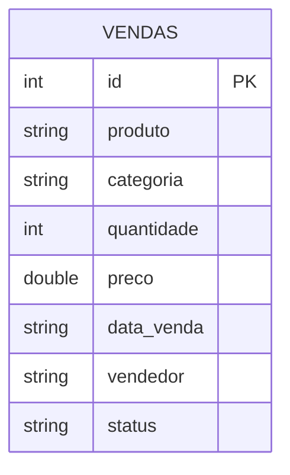

# Contextualização do Trabalho

## Sobre este Projeto

Este trabalho foi desenvolvido como parte da disciplina de **Arquitetura de Dados** e tem como objetivo explorar, na prática, o ecossistema do **Apache Spark** em conjunto com duas tecnologias modernas de *open table formats*: **Delta Lake** e **Apache Iceberg**.

!!! info "Grupo"
    **Gustavo Dias** e **Lucas Oliverio**

---

## Cenário de Negócio

Para demonstrar as funcionalidades de cada tecnologia, utilizamos um dataset fictício de **vendas de e-commerce**, representando transações de uma loja virtual ao longo do tempo.

O cenário simula operações reais de um sistema de dados onde registros precisam ser:

- **Inseridos** conforme novos pedidos chegam
- **Atualizados** quando o status de um pedido muda (ex: "pendente" → "entregue")
- **Deletados** quando pedidos são cancelados ou estornados

Esse tipo de operação é exatamente onde tecnologias como Delta Lake e Iceberg brilham, pois o Hadoop/Parquet tradicional não suporta UPDATE e DELETE nativamente.

---

## Modelo de Dados (ER)

A tabela principal utilizada nos experimentos é a `vendas`, com o seguinte esquema:



### Descrição dos Campos

| Campo | Tipo | Descrição |
|---|---|---|
| `id` | `INT` | Identificador único da venda |
| `produto` | `STRING` | Nome do produto vendido |
| `categoria` | `STRING` | Categoria do produto (Eletrônicos, Roupas, etc.) |
| `quantidade` | `INT` | Quantidade de itens vendidos |
| `preco` | `DOUBLE` | Preço unitário do produto (R$) |
| `data_venda` | `STRING` | Data da transação (formato `YYYY-MM-DD`) |
| `vendedor` | `STRING` | Nome do vendedor responsável |
| `status` | `STRING` | Status do pedido: `pendente`, `pago`, `entregue`, `cancelado` |

---

## DDL das Tabelas

=== "Delta Lake (SQL)"

    ```sql
    CREATE TABLE IF NOT EXISTS vendas (
        id        INT,
        produto   STRING,
        categoria STRING,
        quantidade INT,
        preco     DOUBLE,
        data_venda STRING,
        vendedor  STRING,
        status    STRING
    )
    USING DELTA
    LOCATION './delta-warehouse/vendas';
    ```

=== "Apache Iceberg (SQL)"

    ```sql
    CREATE TABLE IF NOT EXISTS local.db.vendas (
        id        INT,
        produto   STRING,
        categoria STRING,
        quantidade INT,
        preco     DOUBLE,
        data_venda STRING,
        vendedor  STRING,
        status    STRING
    )
    USING iceberg
    LOCATION './iceberg-warehouse/vendas';
    ```

---

## Por que Delta Lake e Iceberg?

O Parquet puro, embora eficiente para leitura, não suporta operações transacionais ACID. As tecnologias de *open table format* surgem para resolver esse problema:

| Característica | Parquet Puro | Delta Lake | Apache Iceberg |
|---|:---:|:---:|:---:|
| ACID Transactions | ❌ | ✅ | ✅ |
| UPDATE / DELETE | ❌ | ✅ | ✅ |
| Time Travel | ❌ | ✅ | ✅ |
| Schema Evolution | Limitado | ✅ | ✅ |
| Suporte a Spark | ✅ | ✅ | ✅ |
| Multi-engine | ❌ | Parcial | ✅ |

---

## Estrutura do Projeto

```
Apache-Spark/
├── pyproject.toml       # Dependências (UV)
├── README.md            # Documentação do ambiente
├── delta_lake.ipynb     # Notebook — Delta Lake
├── iceberg.ipynb        # Notebook — Apache Iceberg
├── mkdocs.yml           # Configuração desta documentação
└── docs/                # Páginas desta documentação
```

---

## Fontes de Referência

- [Apache Spark — Documentação Oficial](https://spark.apache.org/docs/latest/)
- [Delta Lake — Documentação Oficial](https://docs.delta.io/)
- [Apache Iceberg — Documentação Oficial](https://iceberg.apache.org/)
- [Canal DataWay BR — YouTube](https://www.youtube.com/@DataWayBR)
- [spark-delta — jlsilva01](https://github.com/jlsilva01/spark-delta)
- [spark-iceberg — jlsilva01](https://github.com/jlsilva01/spark-iceberg)
