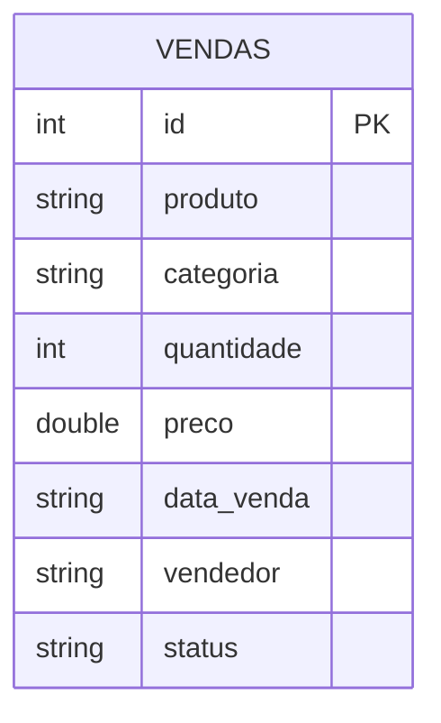

---
hide:
  - navigation
  - toc
---

# Apache Spark · Delta Lake · Iceberg { .hero-title }

Um estudo prático sobre *open table formats* modernos executados em PySpark, com demonstrações reais de transações ACID, Time Travel e snapshots sobre um único dataset de vendas.

[Começar pelo Spark :material-arrow-right:](spark.md){ .md-button .md-button--primary }
[Ver no GitHub :simple-github:](https://github.com/gustavofelisbino/Apache-Spark){ .md-button }

---

## Explore a documentação { .reveal }

<div class="grid cards reveal" markdown>

-   :simple-apachespark:{ .lg .middle .accent-spark } &nbsp; __Apache Spark & PySpark__

    ---

    Como o Spark distribui o processamento, DataFrames, *lazy evaluation* e a `SparkSession` que dá vida ao projeto.

    [:octicons-arrow-right-24: Ler sobre Spark](spark.md)

-   :material-layers-triple:{ .lg .middle .accent-delta } &nbsp; __Delta Lake__

    ---

    Transações ACID sobre Parquet, Time Travel e MERGE. Criado pela Databricks, mantido pela Linux Foundation.

    [:octicons-arrow-right-24: Ler sobre Delta Lake](delta_lake.md)

-   :material-snowflake:{ .lg .middle .accent-iceberg } &nbsp; __Apache Iceberg__

    ---

    Snapshots, particionamento oculto e leitura *multi-engine*. Formato aberto criado pela Netflix para data lakes em escala.

    [:octicons-arrow-right-24: Ler sobre Iceberg](iceberg.md)

</div>

## Contextualização { .reveal }

Este repositório contém a implementação prática de um ambiente **PySpark** com dois dos formatos de tabela aberta mais importantes do ecossistema de *big data* moderno: **Delta Lake** e **Apache Iceberg**.

O objetivo é demonstrar, dentro do mesmo projeto e sobre o mesmo dataset, como cada tecnologia executa operações transacionais que o Parquet puro não suporta nativamente.

!!! info "Grupo"
    **Gustavo Dias** e **Lucas Oliverio** — Arquitetura de Dados

## Cenário de negócio { .reveal }

Para demonstrar as funcionalidades de cada tecnologia, utilizamos um dataset fictício de **vendas de e-commerce**, representando transações de uma loja virtual ao longo do tempo. O cenário simula operações reais onde registros precisam ser:

- :material-database-plus: **Inseridos** conforme novos pedidos chegam
- :material-database-edit: **Atualizados** quando o status muda (ex: `pendente` → `entregue`)
- :material-database-remove: **Deletados** quando pedidos são cancelados

Esse tipo de operação é exatamente onde Delta Lake e Iceberg brilham, já que o Parquet tradicional não suporta `UPDATE` e `DELETE` nativamente.

## Modelo de dados { .reveal }

A tabela principal utilizada nos experimentos é a `vendas`:



| Campo | Tipo | Descrição |
|---|---|---|
| `id` | `INT` | Identificador único da venda |
| `produto` | `STRING` | Nome do produto vendido |
| `categoria` | `STRING` | Categoria do produto |
| `quantidade` | `INT` | Quantidade de itens vendidos |
| `preco` | `DOUBLE` | Preço unitário (R$) |
| `data_venda` | `STRING` | Data da transação (`YYYY-MM-DD`) |
| `vendedor` | `STRING` | Nome do vendedor responsável |
| `status` | `STRING` | `pendente`, `pago`, `entregue`, `cancelado` |

## DDL das tabelas { .reveal }

=== "Delta Lake"

    ```sql
    CREATE TABLE IF NOT EXISTS vendas (
        id         INT,
        produto    STRING,
        categoria  STRING,
        quantidade INT,
        preco      DOUBLE,
        data_venda STRING,
        vendedor   STRING,
        status     STRING
    )
    USING DELTA
    LOCATION './delta-warehouse/vendas';
    ```

=== "Apache Iceberg"

    ```sql
    CREATE TABLE IF NOT EXISTS local.db.vendas (
        id         INT,
        produto    STRING,
        categoria  STRING,
        quantidade INT,
        preco      DOUBLE,
        data_venda STRING,
        vendedor   STRING,
        status     STRING
    )
    USING iceberg
    LOCATION './iceberg-warehouse/vendas';
    ```

## Comparativo { .reveal }

| Característica | Parquet Puro | Delta Lake | Apache Iceberg |
|---|:---:|:---:|:---:|
| ACID Transactions | :material-close: | :material-check: | :material-check: |
| UPDATE / DELETE | :material-close: | :material-check: | :material-check: |
| Time Travel | :material-close: | :material-check: | :material-check: |
| Schema Evolution | Limitado | :material-check: | :material-check: |
| Suporte a Spark | :material-check: | :material-check: | :material-check: |
| Multi-engine | :material-close: | Parcial | :material-check: |

## Estrutura do projeto { .reveal }

```
Apache-Spark/
├── pyproject.toml       # Dependências (UV)
├── README.md            # Documentação do ambiente
├── delta_lake.ipynb     # Notebook — Delta Lake
├── iceberg.ipynb        # Notebook — Apache Iceberg
├── mkdocs.yml           # Configuração desta documentação
└── docs/                # Páginas desta documentação
```

## Fontes de referência { .reveal }

- [Apache Spark — Documentação oficial](https://spark.apache.org/docs/latest/)
- [Delta Lake — Documentação oficial](https://docs.delta.io/)
- [Apache Iceberg — Documentação oficial](https://iceberg.apache.org/)
- [Canal DataWay BR — YouTube](https://www.youtube.com/@DataWayBR)
- [spark-delta — jlsilva01](https://github.com/jlsilva01/spark-delta)
- [spark-iceberg — jlsilva01](https://github.com/jlsilva01/spark-iceberg)
