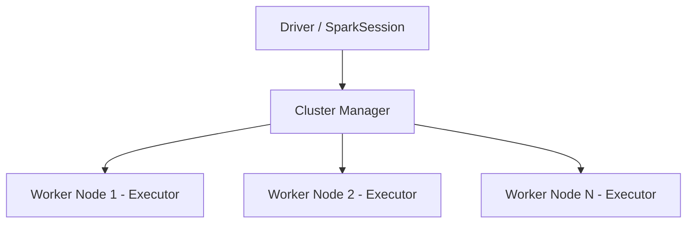

# Apache Spark e PySpark

## O que é o Apache Spark?

Apache Spark é um framework de computação distribuída criado para processar grandes volumes de dados de forma rápida. Foi desenvolvido na Universidade de Berkeley em 2009 e hoje é um dos projetos open-source mais usados em engenharia de dados.

A principal diferença em relação ao Hadoop MapReduce é que o Spark processa os dados em memória, o que o torna muito mais rápido em cargas de trabalho iterativas.

---

## Como funciona a arquitetura

O Spark funciona no modelo driver + executores. O driver é o programa principal que coordena tudo, e os executores são os processos que de fato processam os dados nos nós do cluster.



No nosso caso, como o ambiente é local, tudo roda na mesma máquina com `local[*]`, que usa todos os núcleos disponíveis.

---

## Módulos principais

O Spark é dividido em módulos que atendem casos de uso diferentes:

| Módulo | Para que serve |
|---|---|
| **Spark Core** | Motor base, gerenciamento de memória e execução distribuída |
| **Spark SQL** | Processamento de dados estruturados com DataFrames e SQL |
| **Structured Streaming** | Processamento de dados em tempo real |
| **MLlib** | Machine Learning distribuído |
| **GraphX** | Processamento de grafos |

Neste trabalho usamos principalmente o **Spark SQL** com a API de DataFrames.

---

## PySpark

PySpark é a API Python do Spark. Permite escrever código em Python que roda de forma distribuída no Spark. É a escolha mais comum hoje em dia porque Python já é a linguagem padrão de dados.

---

## Conceitos importantes

### DataFrame

O DataFrame é a estrutura principal do Spark moderno. É parecido com um DataFrame do pandas, mas distribuído e com otimizações automáticas.

```python
from pyspark.sql import SparkSession
from pyspark.sql.functions import col

spark = SparkSession.builder.appName("Exemplo").getOrCreate()

df = spark.createDataFrame([
    (1, "Notebook", "Eletronicos", 3500.00),
    (2, "Camiseta", "Roupas",        89.90),
], ["id", "produto", "categoria", "preco"])

df.filter(col("preco") > 100).show()
```

### Lazy Evaluation

O Spark não executa nada enquanto você está encadeando transformações (`.filter()`, `.select()`, `.groupBy()`). Ele só processa quando você chama uma **ação** como `.show()`, `.collect()` ou `.write`. Isso permite que ele otimize o plano de execução completo antes de rodar.

### SparkSession

É o ponto de entrada para qualquer coisa no Spark. Todo notebook começa criando um:

```python
spark = SparkSession.builder \
    .appName("MeuApp") \
    .master("local[*]") \
    .getOrCreate()
```

---

## Referências

- [Spark Documentation](https://spark.apache.org/docs/latest/)
- [PySpark API Reference](https://spark.apache.org/docs/latest/api/python/)
