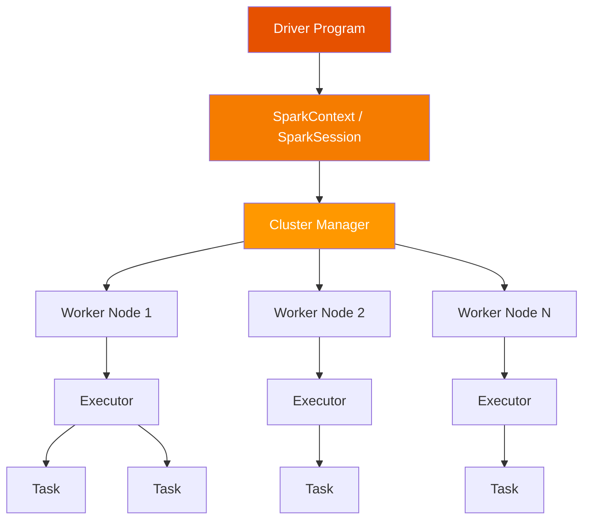
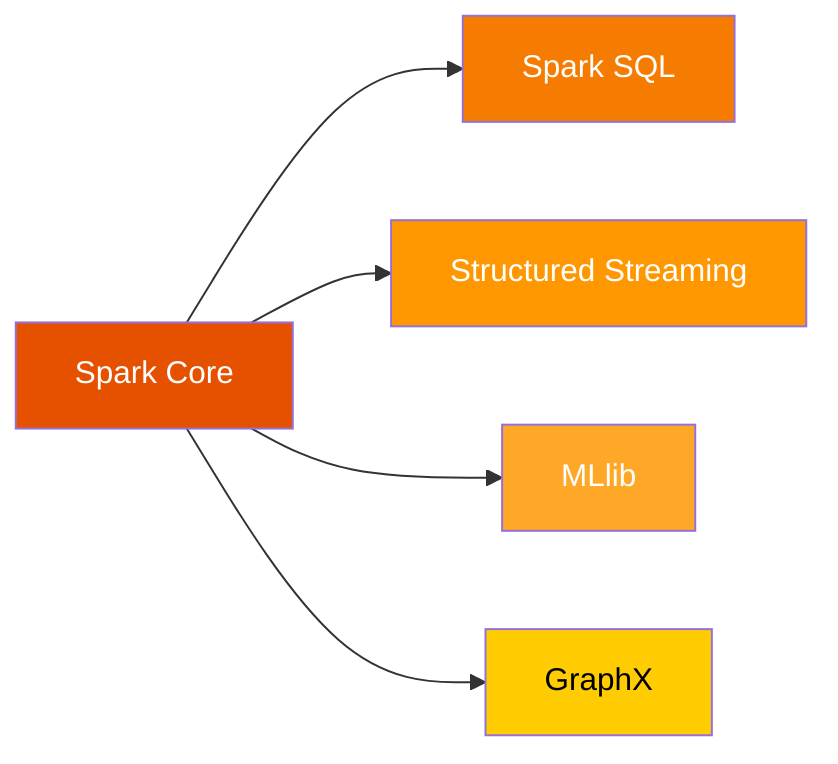
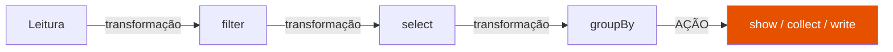

# Apache Spark e PySpark

## O que é o Apache Spark?

**Apache Spark** é um framework de computação distribuída de código aberto projetado para processar grandes volumes de dados de forma rápida e eficiente. Desenvolvido originalmente na Universidade de Berkeley em 2009 e tornado open-source em 2010, o Spark se tornou o principal motor de processamento de big data da atualidade.

Ao contrário do Hadoop MapReduce, que persiste dados intermediários em disco, o Spark realiza processamento **em memória (in-memory)**, o que o torna até **100x mais rápido** em certas cargas de trabalho.

---

## Arquitetura do Spark



### Componentes Principais

| Componente | Papel |
|---|---|
| **Driver** | Programa principal que orquestra a execução |
| **SparkContext / SparkSession** | Ponto de entrada para o Spark |
| **Cluster Manager** | Gerencia os recursos do cluster (YARN, Mesos, Kubernetes, Standalone) |
| **Worker Node** | Máquina que executa as tarefas |
| **Executor** | Processo JVM no Worker que executa as tasks |
| **Task** | Unidade mínima de trabalho executada pelo Executor |

---

## Ecossistema Spark



| Módulo | Descrição |
|---|---|
| **Spark Core** | Motor de execução distribuída, RDDs, gerenciamento de memória |
| **Spark SQL** | Processamento de dados estruturados com SQL e DataFrames |
| **Structured Streaming** | Processamento de dados em tempo real |
| **MLlib** | Biblioteca de Machine Learning distribuída |
| **GraphX** | Processamento de grafos |

---

## PySpark

**PySpark** é a API Python para o Apache Spark. Ela permite escrever aplicações Spark em Python, aproveitando toda a capacidade de processamento distribuído do Spark sem precisar escrever código em Scala ou Java.

### Por que usar PySpark?

- ✅ Python é a linguagem mais popular em Data Science e Engenharia de Dados
- ✅ Integração nativa com pandas, NumPy, scikit-learn
- ✅ APIs modernas: DataFrame, SQL, Streaming
- ✅ Fácil de aprender para quem já conhece pandas

---

## Conceitos Fundamentais

### RDD (Resilient Distributed Dataset)

O RDD é a estrutura de dados fundamental e de mais baixo nível do Spark. Representa uma coleção imutável e distribuída de objetos que pode ser processada em paralelo.

```python
# Exemplo de RDD
sc = spark.sparkContext
rdd = sc.parallelize([1, 2, 3, 4, 5])
resultado = rdd.map(lambda x: x * 2).collect()
print(resultado)  # [2, 4, 6, 8, 10]
```

### DataFrame

O DataFrame é a abstração de alto nível preferida no Spark moderno. Similar ao pandas DataFrame, mas distribuído e com otimizações automáticas via **Catalyst Optimizer**.

```python
from pyspark.sql import SparkSession
from pyspark.sql.functions import col

spark = SparkSession.builder.appName("Exemplo").getOrCreate()

# Criando um DataFrame
df = spark.createDataFrame([
    (1, "Notebook", "Eletrônicos", 2, 3500.00),
    (2, "Camiseta",  "Roupas",      5,   89.90),
], ["id", "produto", "categoria", "quantidade", "preco"])

# Operações
df.filter(col("preco") > 100).show()
```

### Dataset

O Dataset é uma API de nível intermediário disponível em Scala e Java, que combina a segurança de tipos do RDD com as otimizações do DataFrame. Em Python (PySpark), o DataFrame já incorpora o comportamento do Dataset.

---

## Lazy Evaluation

O Spark utiliza **avaliação preguiçosa (lazy evaluation)**: as transformações (`.filter()`, `.select()`, `.groupBy()`) não são executadas imediatamente. A execução só ocorre quando uma **ação** (`.show()`, `.collect()`, `.count()`, `.write`) é chamada.



Isso permite que o Spark otimize todo o plano de execução antes de processar qualquer dado.

---

## SparkSession

A `SparkSession` é o ponto de entrada unificado para todas as funcionalidades do Spark a partir da versão 2.0.

```python
from pyspark.sql import SparkSession

spark = SparkSession.builder \
    .appName("MeuApp") \
    .master("local[*]") \          # local[*] usa todos os núcleos da máquina
    .config("spark.driver.memory", "2g") \
    .getOrCreate()

print(f"Versão do Spark: {spark.version}")
```

### Modos de Execução

| Modo | Descrição | Uso |
|---|---|---|
| `local` | 1 thread, sem paralelismo | Testes simples |
| `local[N]` | N threads locais | Desenvolvimento |
| `local[*]` | Todos os núcleos da CPU | Desenvolvimento |
| `yarn` | Cluster YARN (Hadoop) | Produção |
| `k8s://...` | Kubernetes | Produção cloud-native |

---

## Transformações vs Ações

=== "Transformações (Lazy)"

    | Método | Descrição |
    |---|---|
    | `select()` | Seleciona colunas |
    | `filter()` / `where()` | Filtra linhas |
    | `groupBy()` | Agrupa dados |
    | `join()` | Faz junção entre DataFrames |
    | `withColumn()` | Adiciona/modifica coluna |
    | `drop()` | Remove coluna |
    | `orderBy()` | Ordena resultados |
    | `union()` | Combina DataFrames |

=== "Ações (Eager)"

    | Método | Descrição |
    |---|---|
    | `show()` | Exibe linhas no console |
    | `collect()` | Retorna todos os dados ao driver |
    | `count()` | Conta o número de linhas |
    | `first()` | Retorna a primeira linha |
    | `take(n)` | Retorna as primeiras N linhas |
    | `write` | Persiste dados em disco |
    | `printSchema()` | Exibe o schema do DataFrame |

---

## Formatos de Arquivo Suportados

```python
# Leitura e escrita nos principais formatos
df.write.format("parquet").save("./saida/parquet")
df.write.format("json").save("./saida/json")
df.write.format("csv").option("header", True).save("./saida/csv")
df.write.format("orc").save("./saida/orc")

# Com Delta Lake
df.write.format("delta").save("./saida/delta")

# Com Iceberg
df.write.format("iceberg").save("local.db.tabela")
```

---

## Referências

- [Spark Documentation](https://spark.apache.org/docs/latest/)
- [PySpark API Reference](https://spark.apache.org/docs/latest/api/python/)
- [Databricks Learning](https://www.databricks.com/learn)
